# iaCarry funding pitch deck: slide text

Text of `iaCarry_pitch_jose_elias.pptx`, one section per slide. Wording is the
deck's, with only layout and obvious typos tidied (OTC → OCT, DIC → DEC).
Where a slide uses one of the images kept in `images/` or `images/old/`, it is shown
under that slide. Stock photos and third-party logos are left out and stay in
the `.pptx` only.

---

## 1 · Cover

JANUARY 2024

**iaCarry**: payment in just 6 seconds!

Funding Pitch Deck

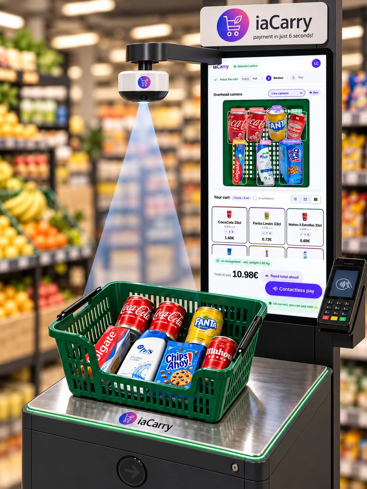

## 2 · iaCarry-Station components

- **Shopping Trolley**: positioned on the weighing platform, filled with items.
- **Weighing Platform**: base unit that detects total weight.
- **Overhead Camera System**: captures top-down view of cart contents.
- **Interactive Display Screen**: shows recognized items and prices.
- **Electronic Payment Terminal**: enables quick and accessible checkout.
- **Exit Turnstile (Post-Checkout)**: opens after successful payment.

Internal / not directly visible:

- **AI-Powered Recognition Software**: analyzes visuals and weight data in real-time.

Video: <https://youtu.be/Sj-IvGnjODE?si=jpAaLexO_-1qCau7>

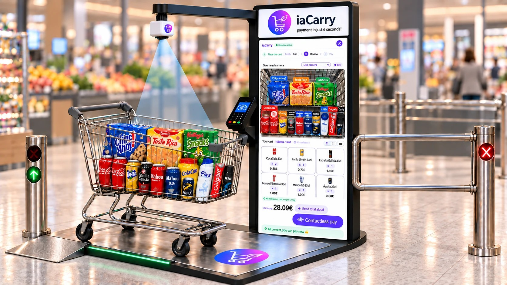

## 3 · Revenue model

*Note: figures in € are estimates.*

1. **Installation and sale of optimal trolley**: installation of the
   iaCarry-Station (scale, camera, screen, etc.) (18000€) and associated
   trolleys (25€ per unit). Training course for shop employees.
2. **Software licence**: licence fee 900€ per month per station. Also
   available on a per recognition basis, on purchases of less than 8€ charge
   0,01€. On purchases over €0.04 (5000 purchases per month for €200).
3. **Maintenance and updates**: maintenance plan for 45€ per month for each
   iaCarry-Station.

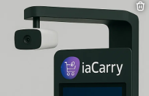

## 4 · Competitors (1 of 2)

1. **Shopic**, Tel Aviv (~70 employees): clip-on device for traditional carts,
   detects products in real-time, enables fast checkout.
2. **Tracxpoint**, Haifa (~30 employees): full smart cart with sensors and
   screen; adds items as you shop, charges on exit.
3. **Caper AI (Instacart)**, New York (~1200 employees): smart cart with
   embedded sensors and display, owned by Instacart.
4. **SuperHii**, China (Xi'an & Jiaxing): smart carts and autonomous retail
   solutions with high efficiency and seamless UX.

## 5 · Competitors (2 of 2)

5. **MagiQeye**, Milan (~5 employees): AI + RFID checkout solution focused on
   clothing and apparel.
6. **Instacart**, California (~1200 employees): mobile self-scanning app; scan
   items during shopping and pay from phone.
7. **Carrefour Flash**, Paris (staffed store): "Just Walk Out"-style store with
   60 cameras and shelf sensors for seamless checkout.
8. **Amazon Go**, various US cities: pioneered "Just Walk Out" tech: entry via
   app, items auto-detected, exit without checkout.

## 6 · Target market: large and small stores

- **Large supermarkets**: reserve a specific area in the supermarket to install
  the iaCarry-Station. This area must be at least 4.5 square meters.
- **Small supermarkets**: efficiently use the available space to ensure that
  the iaCarry-Station integrates seamlessly into the supermarket design.
- **Clothing or furniture stores**: incorporate specialized cameras for
  recognition of clothing items, or packers, considering details such as
  colors, sizes and styles. QR label implementation.

## 7 · The end

**iaCarry**: payment in just 6 seconds!

*(The deck continues after this slide; slides 8–17 work as an appendix.)*

## 8 · Competitive advantages

1. **Conventional trolley**: iaCarry takes advantage of conventional trolleys
   without the need for additional software.
2. **iaCarry-Station easy to install**: iaCarry-Station is as simple as a
   scale, a camera, display and a dataphone, minimising disruption to the
   shop's operation, allowing for easy scalability. Minimal store adaptation.
3. **Managing picaresque through weighing validation**: iaCarry addresses
   picaresque by validating the weighing of products, detecting potential
   irregularities and providing alerts to maintain the integrity of the
   purchasing process.
4. **Bulk product management simply with the camera**: iaCarry's powerful
   camera facilitates bulk product management, enabling accurate
   identification and validation without the need for additional weighing,
   improving the user experience.

## 9 · The current market

23,572 supermarkets in Spain, all of which require barcode scanning.
Only in Europe the figure rises to 234,000 establishments, which need a cash
register.

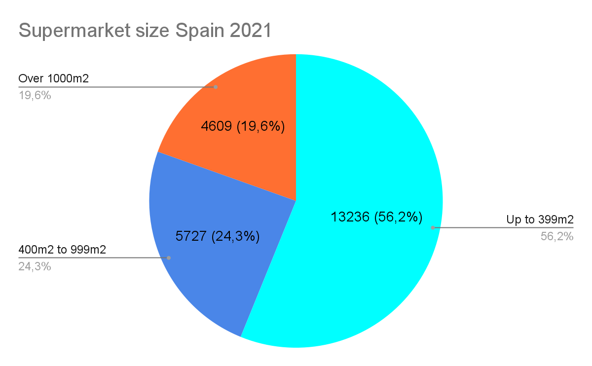

## 10 · The competitors

**Tracxpoint** (Haifa, Israel)

- 2000€ per trolley unit. Multiple cameras inside the trolley.
- Installation of charging points for the trolleys.
- Installation of high capacity wifi network.
- Each trolley is a computer to maintain.
- Expensive implementation.
- Demo: <https://www.youtube.com/watch?v=kS9gWH5fypY>

**Amazon Go and Carrefour Flash**: same concept, take and go.

- Each square metre requires one camera.
- It requires a huge computer capacity for processing.
- Difficult scalability: needs to redo entire shops.
- Still needs the trolley. Not licensable, exclusive.
- Bad picaresque management, no post-purchase validation.
- Demo: <https://www.youtube.com/watch?v=NrmMk1Myrxc>

## 11 · Milestones

| Date | Milestone |
|---|---|
| OCT 2023 | Foundation of tuisku.eu for the creation of iaCarry.tuisku.eu |
| DEC 2023 | Presentation of iaCarry-Station and iaCarry kernel. Presentation of the other product, iaRecycle.tuisku.eu |
| FEB 2024 | First test runs and installations at end-customers. iaRecycle, taking advantage of iaCarry kernel |
| JUN 2024 | Full launch of the first 10 stations in operation. Strong expansion of employees |

## 12 · Scalability

Once you have 10 iaCarry-Stations up and running without errors, scalability
is global. For all shops (supermarkets, clothing, technology, etc.) and for all
countries.

## 13 · Business scalability: clothing or furniture shops

iaCarry in clothing or furniture stores involves customizing the technology to
address the specific characteristics of these sectors, providing customers
with a more efficient and personalized purchasing.

- **Smart labeling system**: use QR smart labels on clothing or furniture with
  barcodes or unique identifiers to facilitate identification by iaCarry.
- **Specialized cameras**: incorporate specialized cameras for recognition of
  clothing items, considering details such as colors, sizes and styles. QR
  label implementation.

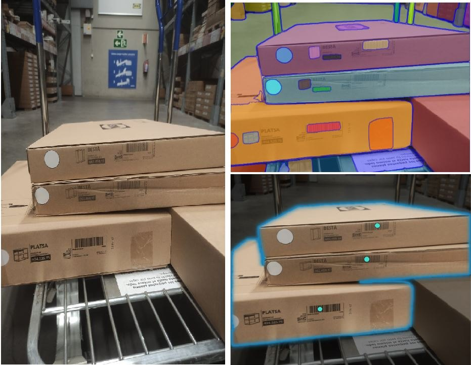

## 14 · Kernel scalability

The iaCarry kernel is powerful, scalable and implementable in other products.
With it, tuisku.eu presents:

**iaRecycle**: automatic recycling with AI, zero-waste technologies.
<https://iarecycle.tuisku.eu/>

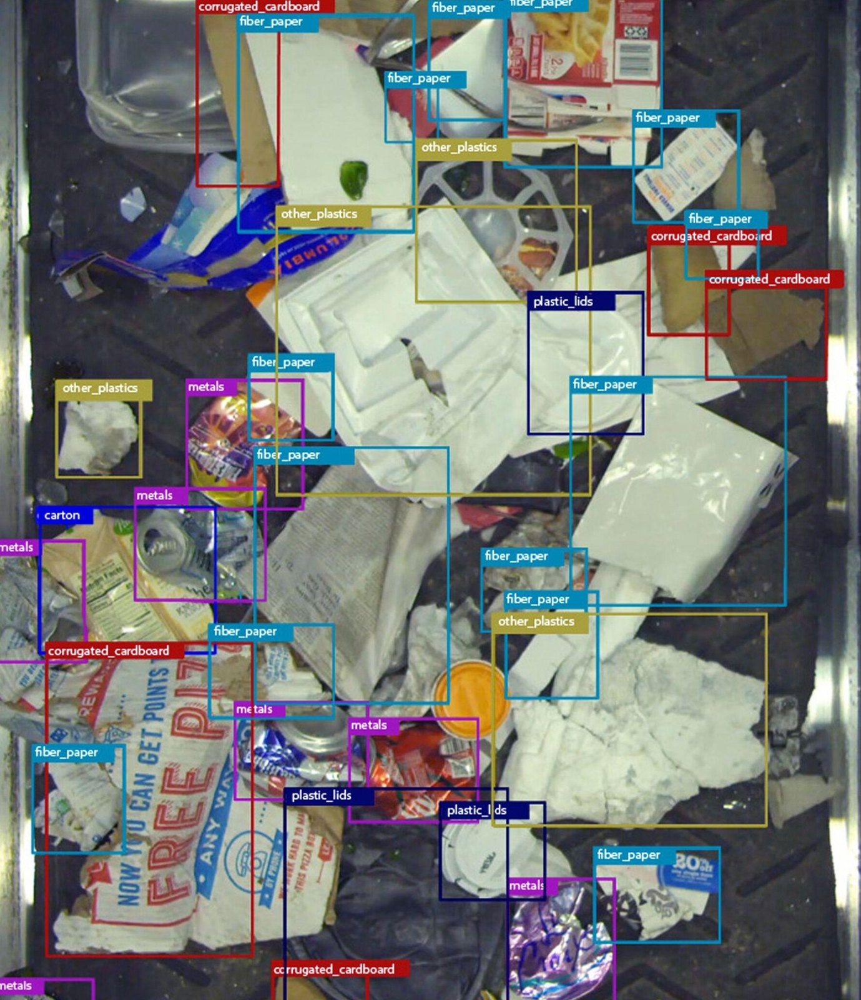

## 15 · The investment: the needs of iaCarry.tuisku.eu

- Renting of calculation servers for the resolution of models.
- Increase of 2 persons in the development department (implementations with
  more customers, development of iaRecycle).
- One person in quality, for our management of the preventive maintenance of
  the vital bug; with basic bugs there is no scalability of the code.
- Strong policy of expansion of national (2 people) and foreign (5 people)
  commercials.

## 16 · Questions? Let's get talking.

Know more: <https://tuisku.eu/> · <https://iacarry.tuisku.eu/> ·
<https://iarecycle.tuisku.eu/>

| E-mail | Address | Phone |
|---|---|---|
| info@tuisku.eu sales@tuisku.eu l.castillo@tuisku.eu | Calle la Fanderia, 2, 48901 Barakaldo, Biscay (Bilbao, Spain) | +34653288969 |

## 17 · Contact

Same contact details as slide 16.

---

## Appendix: how it works and the demo screen

Not in this deck. The text and images below come from the earlier deck,
`Pitch_deck_iaCarry_iaRecycle_05_1.pptx` (March 2024, slides 4, 5, 8 and 9),
which is not kept in the repository.

### The demo screen

With just an aerial image of the trolley, the purchase is done, in just
6 seconds.

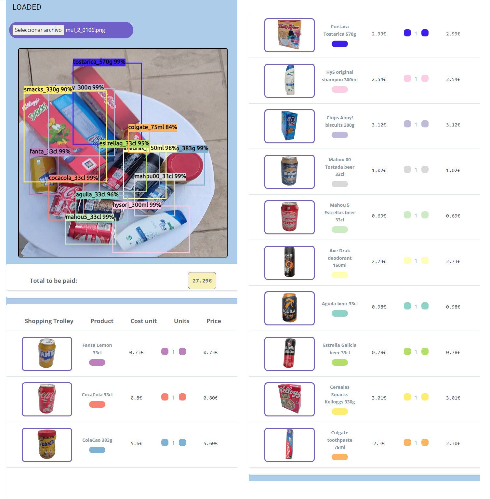

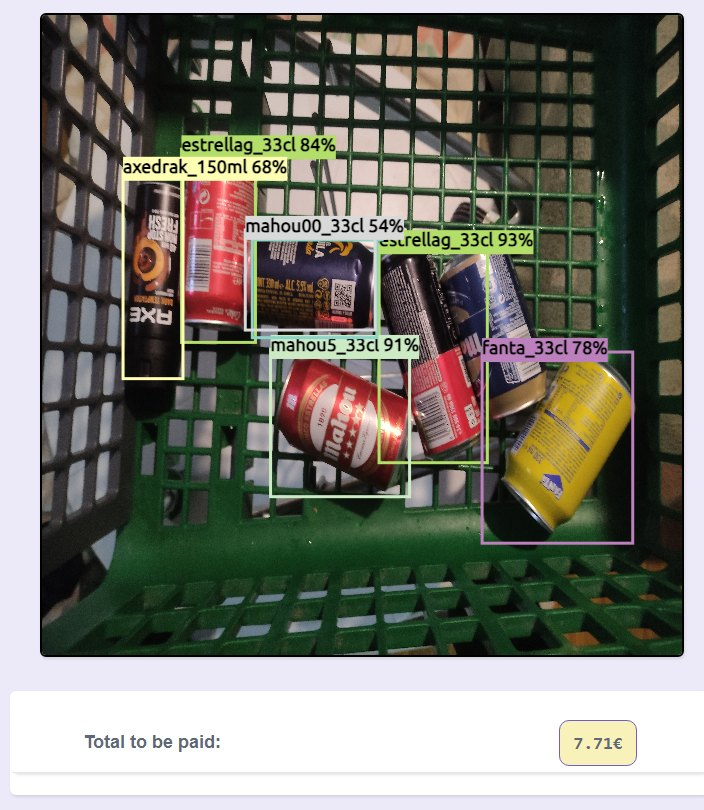

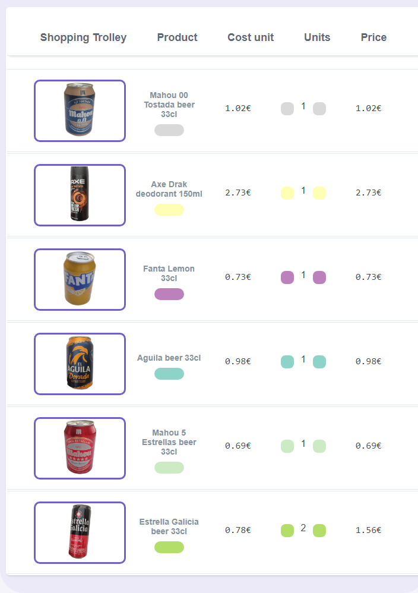

### How does it work?

1. **Positioning on the scale**: when the customer completes the purchase, he
   arrives at the iaCarry-Station scale and places his shopping cart.
2. **Start of recognition**: once positioned, a quick aerial photo of the cart
   begins the recognition process.
3. **Processing with artificial intelligence**: powerful artificial
   intelligence, developed with Google TensorFlow and computer vision from
   Facebook, comes into action to identify each product in the cart.
4. **Detailed data association**: each product is associated with its
   barcode, price and weight, generating a detailed and accurate list of the
   items in the cart.

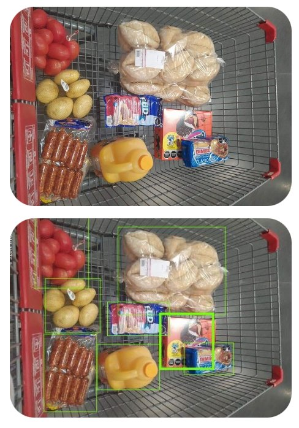

5. **Continuous customer communication**: throughout the entire process, the
   customer receives visual and audible signals on the station screen, from
   initial loading to confirmation of product recognition.
6. **Efficient electronic payment**: with the list complete, the customer
   makes payment electronically at the associated dataphone.
7. **Automatic pass through**: once the transaction is completed, the pass
   through signal is automatically activated, allowing the customer to push
   the cart to the exit without delay.

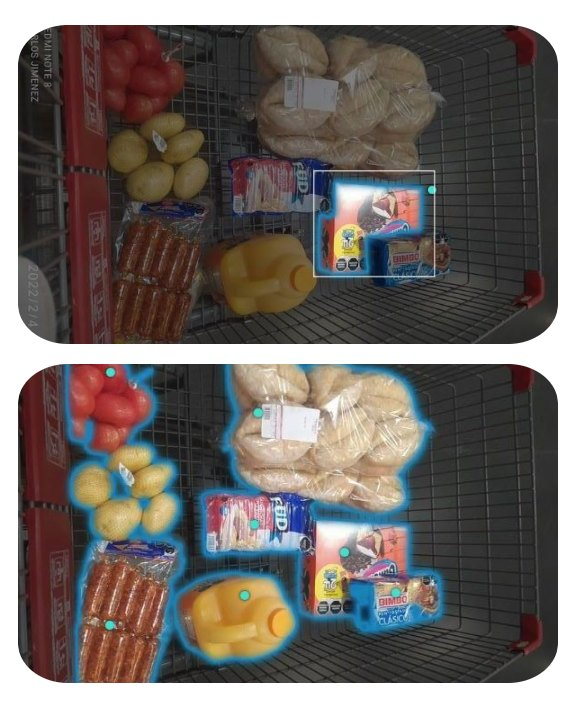

Demo video (embedded in that deck, slide 10):
<https://www.youtube.com/watch?v=yhuZqXP_Mpw>
