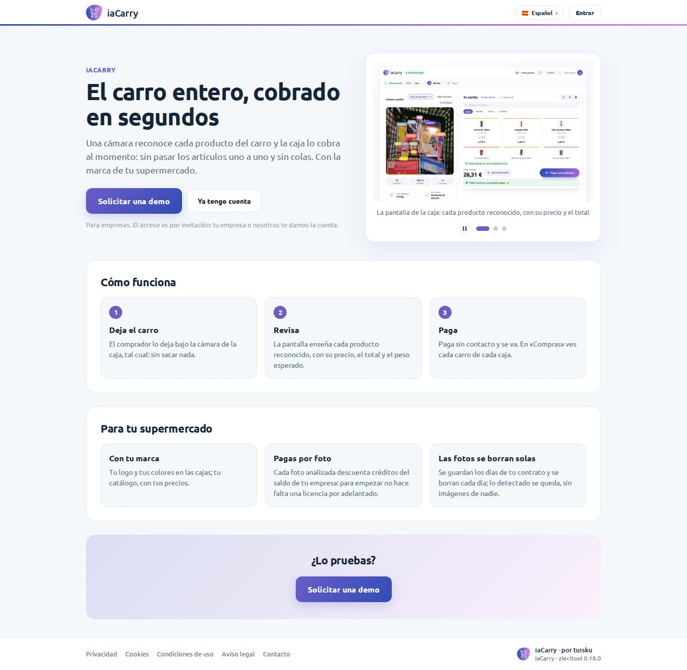
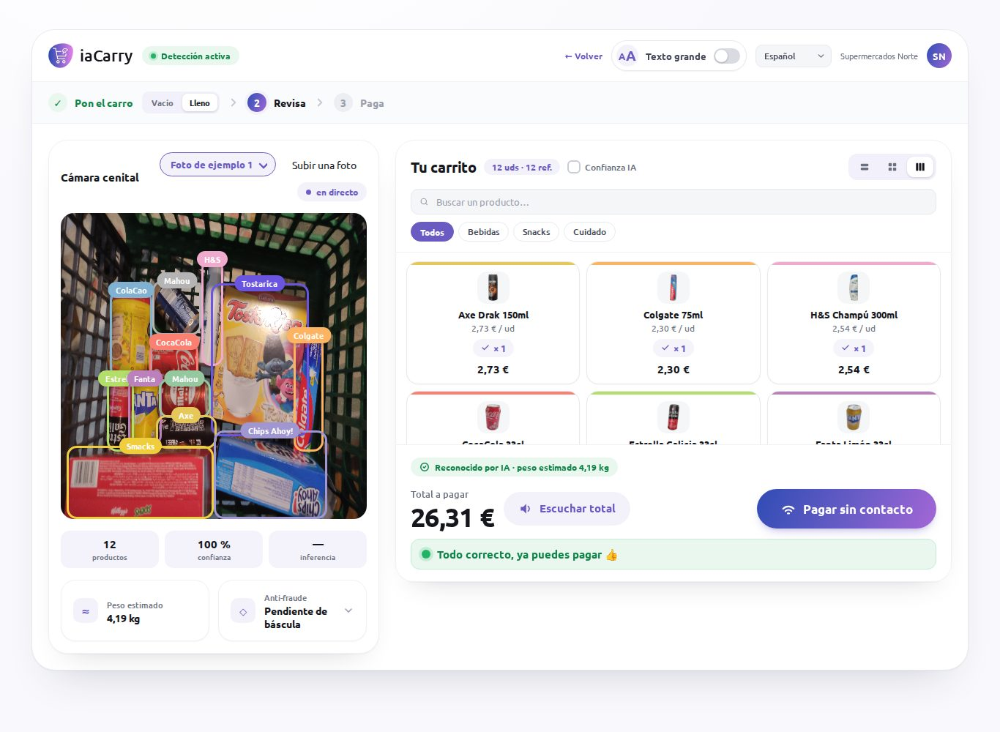
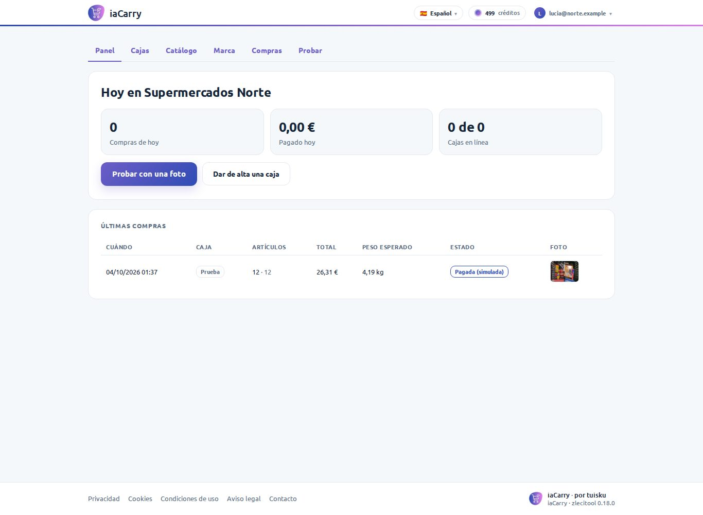
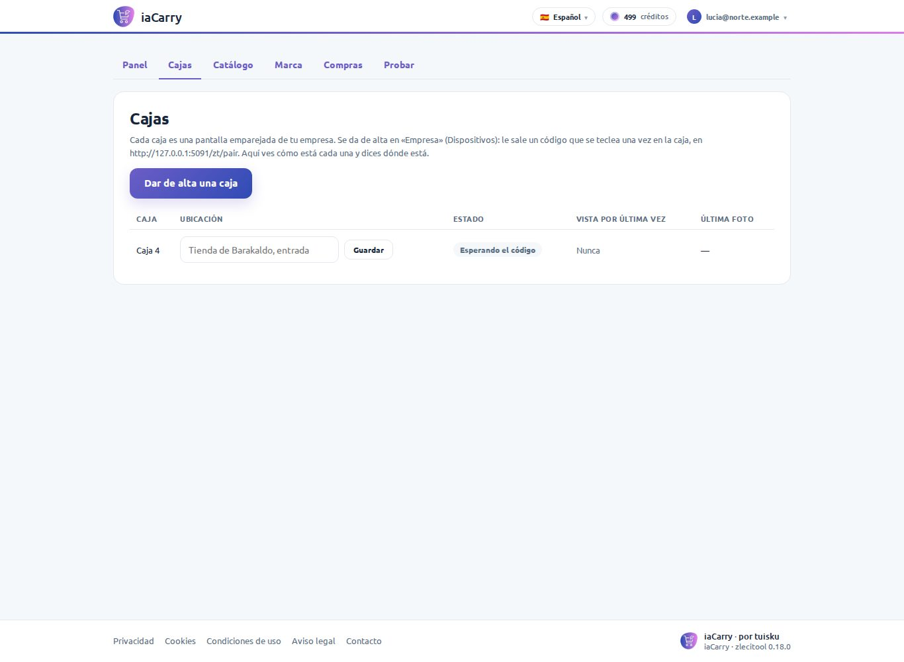
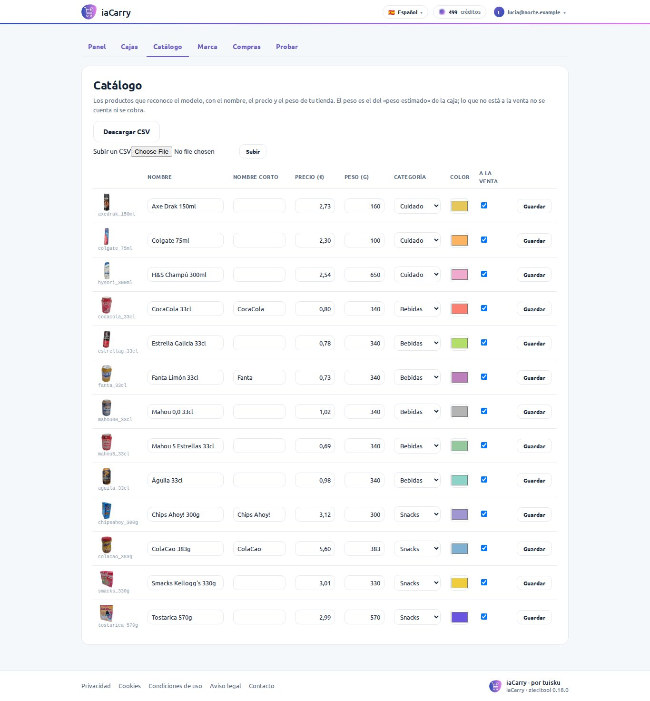
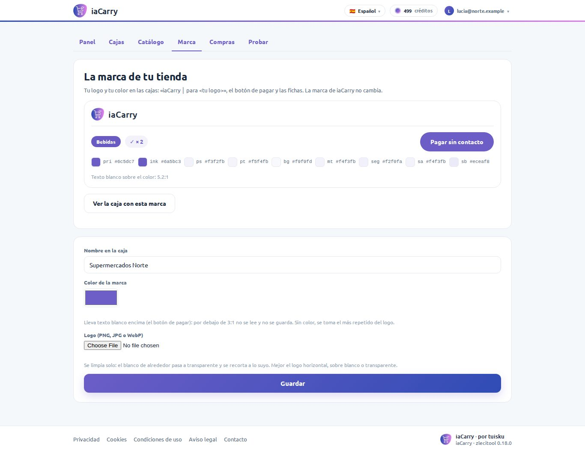
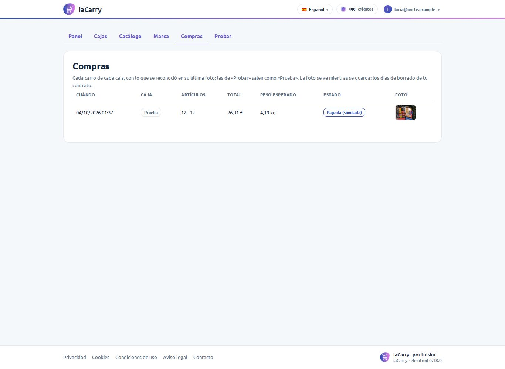
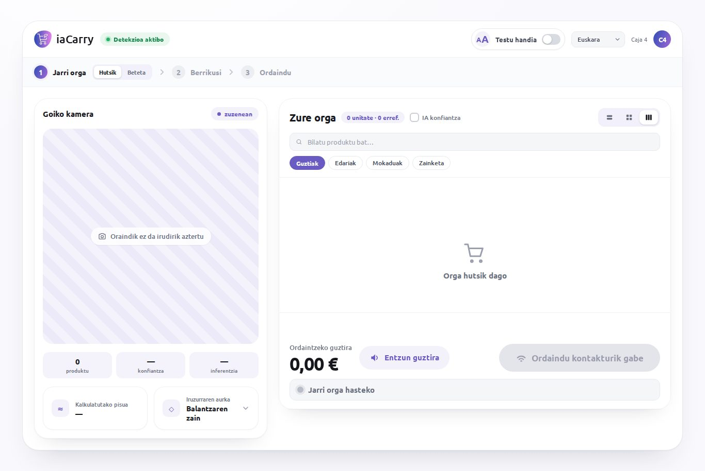
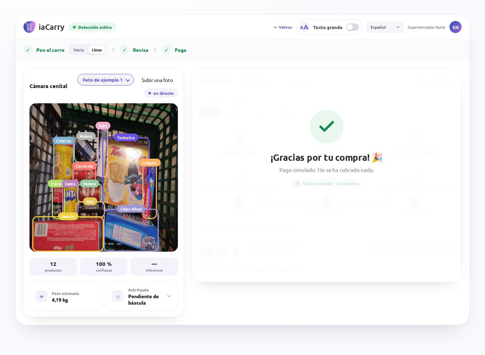

# iaCarry

**Autocobro con inteligencia artificial para supermercados**: el comprador deja
el carro bajo la cámara de la caja, la pantalla enseña cada producto
reconocido con su precio, el total y el peso esperado, y paga en segundos.

Es una herramienta **de empresa** de **tuisku** (familia zlecitool), hecha
sobre el núcleo común `zlecitool-core` (0.18): lo común (cuentas de empresa,
invitaciones, seguridad, idiomas en vivo, la marca, páginas legales, datos,
el saldo de la empresa, las máquinas emparejadas, el borrado de lo que caduca,
pruebas) viene de él, y aquí sólo está lo propio. La usan las personas de cada
supermercado cliente (la trastienda) y sus cajas (pantallas emparejadas), y la
paga el saldo de la empresa: un crédito por foto analizada.

El plan que la trajo aquí es `IACARRY_INTEGRATION_PLAN.md` (fuera del repo; fases P1–P3 hechas:
la herramienta sobre el núcleo, los clientes y las cajas). Lo que sigue en
`tuisku_iaCarry` (ingesta, entrenamiento, presentación y el detector) está
en «El detector», abajo.

| La portada, sin sesión | La caja, con una foto analizada |
|---|---|
|  |  |

## Las dos superficies

### La trastienda (personas de la empresa)

Páginas sobre `zt/base.html`, con la marca de iaCarry, la barra, el saldo de
la empresa y la cuenta del núcleo. Lo que cambia algo (el catálogo, la marca,
dónde está cada caja) sólo lo hacen sus dueños y administradores
(`org_admin_required`); los miembros lo ven.

| Ruta | Qué | Quién |
|---|---|---|
| `/` | **Panel**: compras pagadas de hoy, lo cobrado, cajas en línea y las últimas compras (sin sesión, la portada pública) | miembros |
| `/stations` | **Cajas**: cada pantalla emparejada, su ubicación, si está en línea (vista en los últimos 5 minutos), esperando su código o revocada, y su última foto | miembros (cambiar la ubicación: administradores) |
| `/catalogue` | **Catálogo**: los productos que reconoce el modelo, con el nombre, el precio (céntimos), el peso (gramos), la categoría, el color y si está a la venta; CSV de ida y vuelta (`/catalogue.csv`, `/catalogue/import`) | miembros (cambiarlo: administradores) |
| `/branding` | **Marca**: el logo del supermercado (se limpia solo: el blanco de alrededor pasa a transparente y se recorta) y su color, con la paleta que sale de él, su contraste y una vista previa de la caja | miembros (cambiarla: administradores) |
| `/checkouts` | **Compras**: cada carro de cada caja (cuándo, caja, artículos, total, peso esperado, estado) y su foto mientras se guarda | miembros |
| `/demo` | **Probar**: la caja tal cual, con las fotos de ejemplo o una propia; cada foto cobra `demo_recognition` | miembros |
| `/cuenta/empresa` | **Empresa** (del núcleo): las personas, las invitaciones y las máquinas (dar de alta una caja) | dueños y administradores |

| El panel | Las cajas | El catálogo |
|---|---|---|
|  |  |  |

| La marca del supermercado | Las compras |
|---|---|
|  |  |

### La caja (una máquina de la empresa)

`/station`, sobre `zt/bare.html` (sin barra, ni menú, ni pie): la pantalla del
comprador, la de `serving/templates/iacarry_checkout.html` llevada al núcleo
sin cambiar su forma de trabajar (`static/js/station.js`,
`static/css/station.css`, `templates/station.html`). No entra ninguna persona:
es un **navegador emparejado** de la empresa (`@device(home=True)`, núcleo
0.18).

1. En «Empresa» → «Dispositivos», un administrador da de alta la caja («Caja 4»).
   Le sale un código de 8 caracteres, válido diez minutos.
2. En el navegador de la caja (Chromium en modo quiosco), una vez:
   `https://iacarry.eu/zt/pair`, el código, y la caja queda emparejada y en
   `/station`. Desde entonces la cookie `zt_device_iacarry` la reconoce.
3. En «Cajas» se le pone la ubicación («Tienda de Barakaldo, entrada»). Se
   revoca con un clic en «Empresa», y deja de cobrar en el acto.

Cada foto va a `POST /station/detect` (`@device`), que la cobra a la empresa
(`recognition`), la pasa al detector, apunta el carro y la foto, y contesta
**el contrato de siempre de `/upload`** (los `boundingBox` con `width`/`height`
que en realidad son el borde derecho e inferior), más `request_id`,
`checkout_id` y `frame_id`. El `X-Request-Id` de cada foto, que pone la
página, es la clave del cobro: una foto repetida tras un corte de red se cobra
y se analiza una vez. Si el detector falla o está ocupado, la caja se pone en
rojo («avisa a un asistente») y no se cobra; sin saldo, lo mismo
(`errOrgCreditsNeeded`), nunca una página de pago en la tienda.

Los idiomas son los del comprador, en el selector de la caja: español, inglés,
euskera, catalán, gallego, portugués, francés y alemán (la ficha,
`"languages"`).



**Las tres costuras**, cada una en una función de `station.js`, como en el
original, y `window.iaCarry` como la superficie de integración y de pruebas:

| Costura | Hoy | Para conectarla |
|---|---|---|
| La cámara cenital | No hay señal en directo: la caja recibe las fotos de `window.iaCarry.submitFrame(blob, nombre)` (y, en «Probar» o en la empresa de demostración, de las fotos de ejemplo o un fichero) | quien integre la cámara de la tienda llama a `submitFrame`; si la lee el propio navegador, `"permissions": ["camera"]` en la ficha |
| El sensor del carro | El interruptor «Vacío / Lleno» del paso 1 (`setCartPresent`) | `CART_SENSOR_BACKEND` |
| El pago y la puerta | Simulado y dicho en la pantalla («Pago simulado»); la compra se apunta como pagada (simulada) en «Compras» | `requestPayment()` y `PAYMENT_BACKEND` |



### La empresa de demostración

La demo de ventas de tuisku (varios supermercados en un desplegable) es una
empresa marcada como de demostración:

```
flask --app app iacarry demo <empresa>          # --off para quitarlo
```

Sus cajas y su «Probar» enseñan el desplegable de supermercados
(`static/logos/`) y las fotos de ejemplo. Los clientes de verdad nunca ven
ninguna de las dos cosas: su caja lleva su propia marca. **Los logos de
`static/logos/` son marcas registradas**: sólo para la empresa de demostración
y con el permiso de cada supermercado (`static/logos/README.md`).

## El detector

TensorFlow no se carga nunca en los procesos web (gunicorn arranca varios, y
cada uno cargaría el modelo): el detector es un **servicio interno aparte**,
`tuisku_iaCarry/serving/detector_service.py`, junto al entrenamiento que hace
su modelo, y aquí sólo se le llama (`iacarry/detector.py`):

| Variable | Qué | Sin ella |
|---|---|---|
| `IACARRY_DETECTOR_URL` | `http://detector:8600`, en la red interna | **el detector falso** (también con `fake`) |
| `IACARRY_DETECTOR_TOKEN` | la ficha compartida con el servicio (cabecera `Authorization: Bearer`) | sin ficha |
| `IACARRY_DETECTOR_TIMEOUT` | segundos de espera | 20 |

Su contrato es `POST /v1/detect` (la foto en multipart `file`, y
`X-Request-Id`), con las esquinas con su nombre de verdad:

```json
{"model_version": "…", "shape_img": [640, 640, 3], "inference_ms": 840,
 "predictions": [{"probability": 0.97, "tagName": "cocacola_33cl",
                  "box": {"x1": 0.2, "y1": 0.1, "x2": 0.35, "y2": 0.4}}]}
```

y un 503 es «ocupado» (su cola está llena): la caja lo dice en el acto, no
espera. La herramienta lo convierte al contrato de la página.

**El detector falso** contesta las fotos de ejemplo con su verdad dibujada a
mano (`iacarry/fixtures/<foto>.json`, las de `serving/demo_labels`) y
cualquier otra foto con `fixtures/_default.json`. Las pruebas lo usan siempre
(`detector.fake_detector()` dice qué contesta mientras dure: otra respuesta,
un fallo, ocupado, o un retraso), y en local deja usar iaCarry entero sin
TensorFlow.

Las clases que conoce el modelo están en `iacarry/model_classes.json` (13,
con su nombre, precio y peso de partida): de ahí sale el catálogo de cada
empresa nueva, que después pone sus precios. Cuando el modelo aprenda un
producto nuevo, se añade ahí y cada empresa lo añade a su catálogo desde
«Catálogo» («Añadir un producto que conoce el modelo»).

## Cobrar

Lo que cuesta, en `tool.json` (créditos por foto; lo paga la empresa):

```json
"prices": {"recognition": 1, "demo_recognition": 1}
```

`recognition` es cada foto de una caja; `demo_recognition`, cada foto en
«Probar». **Son provisionales**: el precio de un crédito para empresas y el de
un reconocimiento los decide el dueño (`docs/COSTES.md`). tuisku apunta las
recargas de cada cliente con su factura (`flask --app app zt org topup …` o
«Clientes» en el panel), le da créditos de prueba y una línea de crédito, y la
empresa recibe un aviso cuando le queda poco. El historial del saldo dice qué
caja gastó qué (su cuenta técnica). El límite diario por cuenta es 5000 (una
caja analiza cientos de fotos al día); por empresa, en «Clientes».

## Las fotos y su borrado

La caja fotografía carros en la tienda del cliente: pueden salir manos, caras o
un niño en el carro. iaCarry lo trata por cuenta del cliente (tuisku es el
encargado del tratamiento). Por eso:

- cada foto se guarda en la carpeta de su empresa,
  `iacarry/frames/o<empresa>/…` (`retention.org_key("frames/", …)`), y **el
  núcleo la borra cada día** a los días de la ficha (`"retention"`: 7) o a los
  del contrato de esa empresa (en «Clientes»). Lo detectado (qué productos,
  cuántos, el total) se queda, sin la imagen;
- una empresa puede no guardar nunca sus fotos:
  `flask --app app iacarry frames <empresa> --off` (y sin `--off`, volver a
  guardarlas);
- la foto sólo la ve la gente de su empresa (`/frames/<id>`), y nunca va en
  los logs.

## Arrancar

```
cp .env.example .env
python -c "import secrets; print(secrets.token_urlsafe(48))"   # → FLASK_SECRET_KEY en .env
python app.py                     # http://localhost:5000
```

Sin `IACARRY_DETECTOR_URL`, con el detector falso. Para tener una empresa con
la que entrar:

```
flask --app app zt org create "Supermercados Norte" --tool iacarry
flask --app app zt org invite supermercados-norte tu@correo --role owner
flask --app app zt org grant supermercados-norte 100 --note "créditos de prueba"
```

(la empresa, por el identificador que da `flask --app app zt org list`; los
comandos, en el CONTRATO.md del núcleo). Una caja también se da de alta desde
la terminal: `flask --app app zt org device <empresa> "Caja 1"`.

**Mientras viva dentro de `tuisku_iaCarry`**, el núcleo de al lado está dos
carpetas más arriba: `pip install -e ../../zlecitool-core[dev,ai] pillow pytest`
en vez de `pip install -r requirements-dev.txt` (que lo busca en
`../zlecitool-core`, donde estará cuando tenga su propio repo).

## Pruebas

```
pytest
```

| Fichero | Qué |
|---|---|
| `tests/test_smoke.py` | `testing.check_tool(app)` (el contrato del núcleo: la puerta, la marca, quién paga, las máquinas, los idiomas, el borrado) y la ficha |
| `tests/test_station.py` | la caja: una foto se reconoce, se apunta y se cobra a la empresa; el mismo `X-Request-Id` una vez; un fallo del detector no se cobra; sin saldo, rechazo; sólo una caja emparejada es una caja, y revocada para en el acto; pagar apunta la compra; «Probar» cobra `demo_recognition`; la empresa de demostración; no guardar fotos |
| `tests/test_backoffice.py` | el catálogo (de las clases del modelo, precios en céntimos, sólo administradores, CSV, un producto fuera de venta ni se cuenta ni se cobra), la marca (paleta de un color, logo limpio, contraste mínimo), las cajas, el panel, cada empresa sólo ve lo suyo, la portada pide una demo |
| `tests/test_retention.py` | las fotos viejas se borran y lo detectado se queda; una reciente, no |
| `tests/test_station_browser.py` | la caja en Chromium, lo de `serving/verify/verify.py`: las cajas a menos de un 1 % de la verdad, cantidades, total y peso, ocupado, los fallos en rojo y sin pagar, sin saldo en rojo, los ocho idiomas sin cortar ningún texto, nada pedido fuera ni nada que falte, cada foto de ejemplo con sus etiquetas, el logo del supermercado por área, el pago simulado apuntado, y una caja emparejada que cobra cada foto en el idioma del comprador |
| `tests/test_layout.py` | las convenciones del repo (el núcleo fijado, gunicorn) |

Sin Chromium o sin playwright, las de navegador se saltan: no las des por
probadas si se saltaron (`pytest -rs` lo dice).

## Qué hay aquí

```
tool.json              la ficha: de empresa, su marca, los ocho idiomas, precios,
                       límite diario y el borrado de las fotos
app.py                 create_app(): el núcleo primero, luego lo propio. Sólo arranque
iacarry/
├── routes.py          la trastienda, la caja y «Probar» (finas)
├── service.py         la lógica, sin Flask: catálogo, marca y paleta, cajas, compras
├── detector.py        el cliente del detector (y el falso)
├── models.py          las tablas iacarry_*: marca, productos, cajas, compras, fotos, ajustes
├── cli.py             flask iacarry demo | frames
├── model_classes.json las clases del modelo, con su catálogo de partida
└── fixtures/          la verdad de las fotos de ejemplo, para el detector falso
templates/             la trastienda (_layout.html y una por pestaña), la caja
                       (station.html, sobre zt/bare.html) y la portada (landing.html)
static/js/station.js   la caja: un state, render(), las costuras, window.iaCarry
static/css/station.css la caja (la paleta del supermercado la pone applyTheme())
static/js/app.js       la trastienda (lo poco que hace falta)
static/brand/          la marca de iaCarry (python -m zlecitool_core.brand.kit)
static/products/       las fotos de los productos del catálogo de partida
static/demo/           las fotos de ejemplo de «Probar»
static/logos/          los logos de la empresa de demostración (con permiso)
static/img/            las imágenes de la portada (scripts/landing_images.py)
i18n/ui.json           los textos propios, en los ocho idiomas
docs/                  FLUJO.md (de un carro vacío a pagado), COSTES.md, img/
tests/                 lo de arriba
.github/workflows/     las pruebas en GitHub (cuando sea su propio repo)
```

## Llevarla a su propio repo

Está dentro de `tuisku_iaCarry` hasta que el dueño cree
`Leci37/zlecitool-iacarry` (plan, §16). La carpeta es entera la herramienta:
se copia tal cual a la raíz del repo nuevo (con su `.github/`, que sólo
funciona en la raíz), junto al núcleo en `../zlecitool-core`, y se le pone el
secreto `ZLECITOOL_CORE_TOKEN`. El README de `tuisku_iaCarry` apunta aquí.

## El núcleo

- **Qué se puede usar:** su `CONTRATO.md`. Lo que no está ahí no se usa.
- **Qué versión:** la fija `requirements.txt` (`@v0.18.0`, producción). En
  desarrollo, editable desde el repo de al lado.
- **Si falta algo en el núcleo,** no se escribe aquí: se añade al núcleo, sale
  una versión nueva y aquí se sube (leyendo su CHANGELOG).

## Desplegar

- `gunicorn -c gunicorn.conf.py "app:create_app()"` (el `Procfile`), en su
  propio dominio (`iacarry.eu`) con su propio `FLASK_SECRET_KEY`: una sesión
  de una herramienta pública no vale en ella.
- Postgres en `DATABASE_URL` (la de la familia), `ZLECITOOL_PUBLIC_URL`,
  `ZLECITOOL_MAIL_FROM="iaCarry <no-reply@iacarry.eu>"`,
  `ZLECITOOL_STORAGE=s3` (fotos y logos), `ZLECITOOL_ADMINS`.
- El detector, en su máquina o contenedor (CPU o GPU), sin salida a internet,
  con `IACARRY_DETECTOR_URL`, `IACARRY_DETECTOR_TOKEN` y
  `IACARRY_DETECTOR_TIMEOUT` en la web.
- Cada caja: Chromium en modo quiosco abriendo `https://iacarry.eu/station`,
  emparejada una vez.
- Copias, avisos de errores y el borrado diario: los del núcleo.

## Ramas

`develop` para trabajar; `main` sólo para versiones publicadas.
